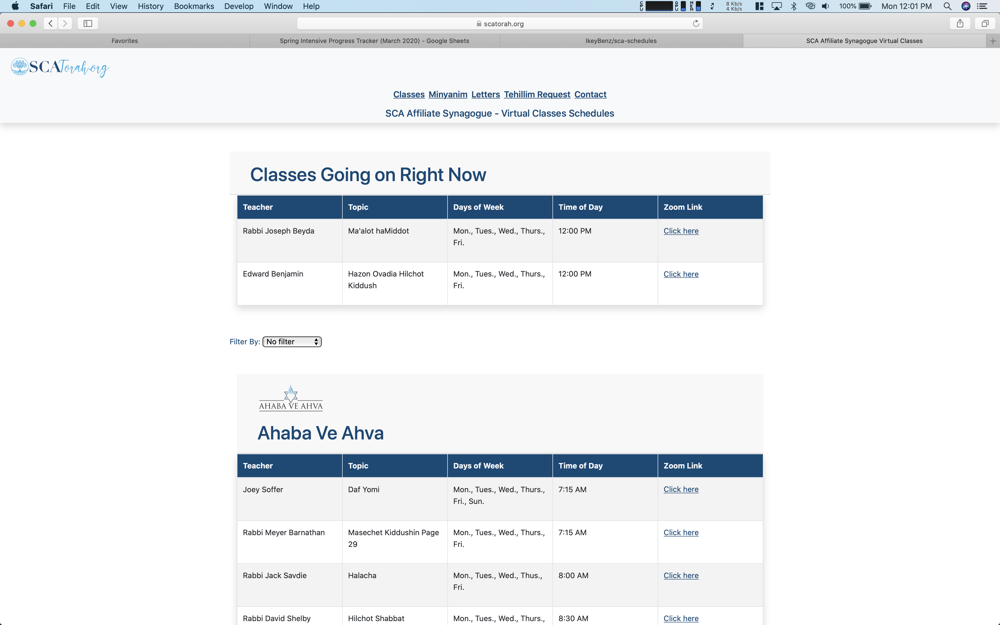

# SCA Schedules

An aethetically pleasing way to display community class schedules and other useful information online.

The corona pandemic has caused disarray amongst communities around the world. Many orginizations have turned to Zoom to continue daily programs. This webapp, written in `React.js & Typescript` allows one orginization in particular to keep their audience up to date regaurding their online class schedule.

Hosted using Github Pages on the domain [scatorah.org](https://scatorah.org)

